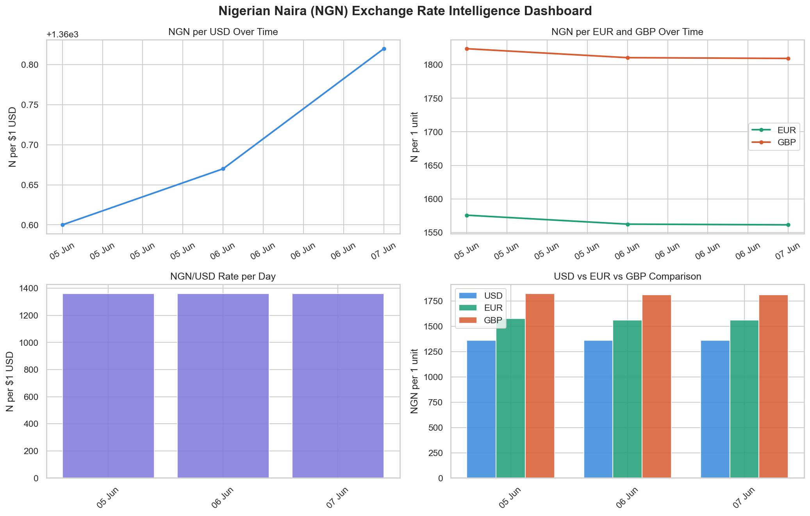

# 🇳🇬 Nigerian Market Price Intelligence Platform

A real-world automated data pipeline that tracks NGN exchange rate 
movements against USD, EUR and GBP. Built as a portfolio project 
demonstrating Python, Pandas, SQL, REST APIs and data visualisation.

## Dashboard Preview


## Tech Stack
| Tool | Purpose |
|------|---------|
| Python + Pandas | Data cleaning & analysis |
| SQLite (SQL) | Data storage & querying |
| ExchangeRate-API | Live data source |
| Matplotlib & Seaborn | Visualisation |
| GitHub Actions | Automated daily pipeline |

## How to Run
```bash
# Install dependencies
pip install -r requirements.txt

# Add your API key to .env file
# EXCHANGE_API_KEY=your_key_here

# Run the pipeline
python src/fetch_data.py
python src/clean_data.py
python src/database.py
python src/visualise.py
```

## Key Insights
- Tracks live NGN/USD, NGN/EUR and NGN/GBP rates daily
- Stores all historical data in a SQL database
- Generates automated dashboard charts
- Pipeline grows more powerful with every day of data

## Roadmap
- [ ] GitHub Actions for fully automated daily runs
- [ ] Add commodity prices (rice, fuel, cement)
- [ ] Deploy live dashboard to Streamlit Cloud
- [ ] Build FastAPI endpoint for third party access
- [ ] Email alerts for large rate movements

## Author
Built by [@Mr-Martynz](https://github.com/Mr-Martynz)