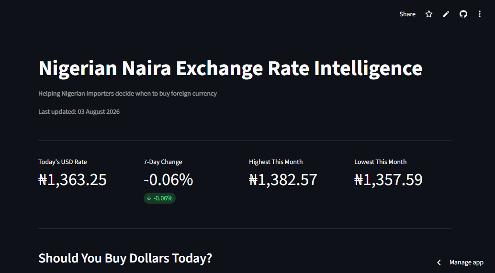
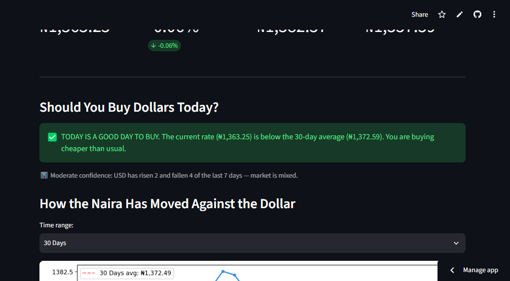
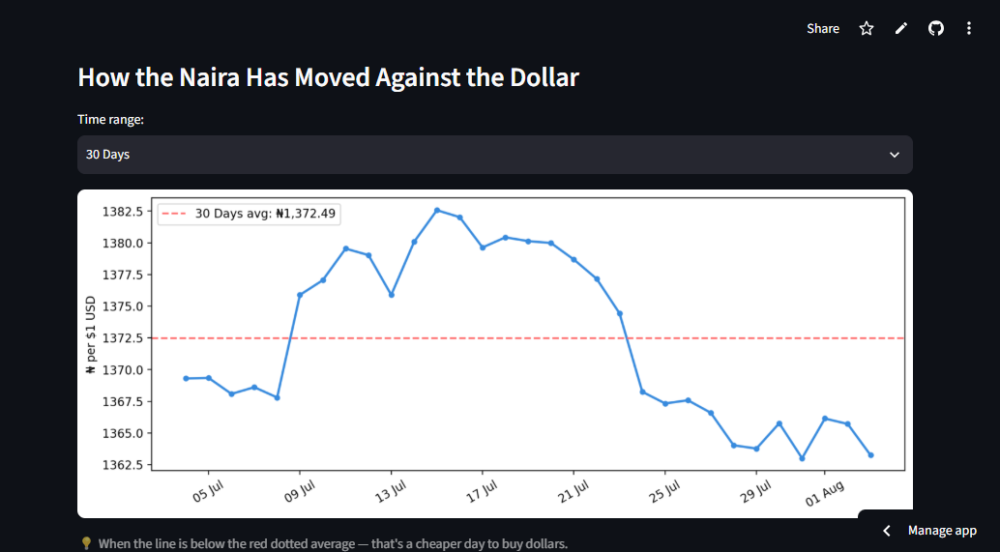
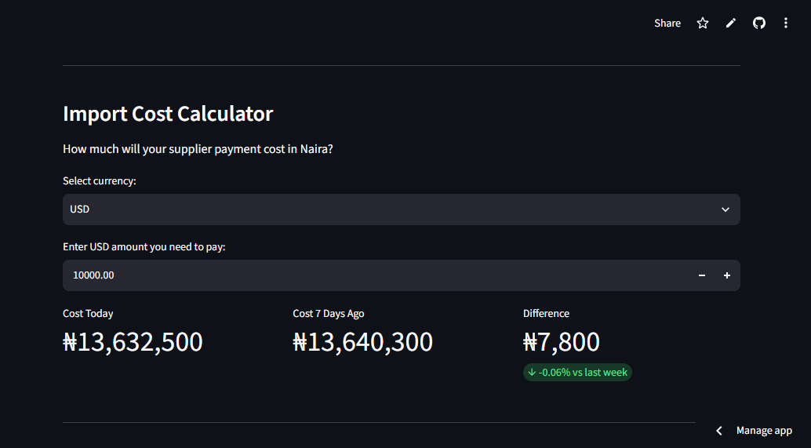

# 🇳🇬 Nigerian Naira Exchange Rate Intelligence

**A live decision-support dashboard that tells Nigerian importers when it's actually a good day to buy foreign currency — not just what the rate is.**

🔗 **Live demo:** [nigeria-market-intelligence.streamlit.app](https://nigeria-market-intelligence.streamlit.app/)

---

## The Problem

Nigerian importers who pay suppliers in USD, EUR, or GBP face a constant question: *is today a good day to convert Naira, or should I wait?* Raw exchange rate numbers don't answer that — you need context: is today's rate high or low compared to the recent trend? Is the Naira strengthening or weakening? What would this payment have cost a week ago?

This dashboard turns raw daily exchange rate data into a direct recommendation, backed by the numbers behind it.

## What It Does

- **Live buy/wait recommendation** — compares today's rate to the 30-day average and gives a clear ✅/⚠️ verdict, with a confidence level based on the last 7 days of momentum.
- **Interactive time range filter** — view trends over 7 days, 30 days, 90 days, or 1 year; the chart, average line, and insights all update to match.
- **Import cost calculator** — enter a payment amount in USD/EUR/GBP and see exactly what it costs in Naira today vs. 7 days ago.
- **Automated business insights** — plain-language callouts like *"today's rate is the lowest in the last 90 days"* or *"importing is 2% more expensive than last week."*
- **Fully automated data pipeline** — a scheduled job fetches fresh rates daily, cleans and stores them, and redeploys the live dashboard with zero manual intervention.

## Tech Stack

| Layer | Tools |
|---|---|
| Data pipeline | Python, GitHub Actions (scheduled daily fetch) |
| Data processing | Pandas |
| Storage | JSON (raw) → processed dataframe |
| Visualization | Matplotlib |
| Web app / UI | Streamlit |
| Deployment | Streamlit Community Cloud |

## Screenshots

**Dashboard overview & key metrics**


**Buy/wait decision card**


**Interactive historical chart with time range filter**


**Import cost calculator**


## Running It Locally

```bash
git clone https://github.com/Mr-Martynz/nigeria-market-intelligence.git
cd nigeria-market-intelligence
python -m venv venv
venv\Scripts\Activate.ps1   # Windows PowerShell
pip install -r requirements.txt
streamlit run app.py
```

You'll need an API key from [exchangerate-api.com](https://www.exchangerate-api.com/) (free tier works) set as an environment variable or GitHub secret named `EXCHANGE_API_KEY` for the data pipeline to fetch live rates.

## How the Automation Works

A GitHub Actions workflow (`.github/workflows/daily_fetch.yml`) runs every morning on a schedule. It:
1. Fetches the latest conversion rates from the exchange rate API.
2. Cleans and processes the data.
3. Commits the new data back to the repo.
4. Pings the live Streamlit app to keep it awake.

No manual updates needed — the dashboard stays current on its own.

## Future Improvements

- [ ] Email/SMS alerts when the rate hits a user-defined threshold
- [ ] Add more currencies (e.g. CNY, CAD)
- [ ] Historical data export (CSV download button)
- [ ] Predictive short-term rate trend (simple time-series forecasting)

## About This Project

Built as part of a portfolio demonstrating end-to-end data pipeline design, automation, and product-focused dashboard development — from raw API data to a polished, business-oriented decision tool.

---

*Questions or interested in similar work? Feel free to reach out via [GitHub](https://github.com/Mr-Martynz) or open an issue on this repo.*